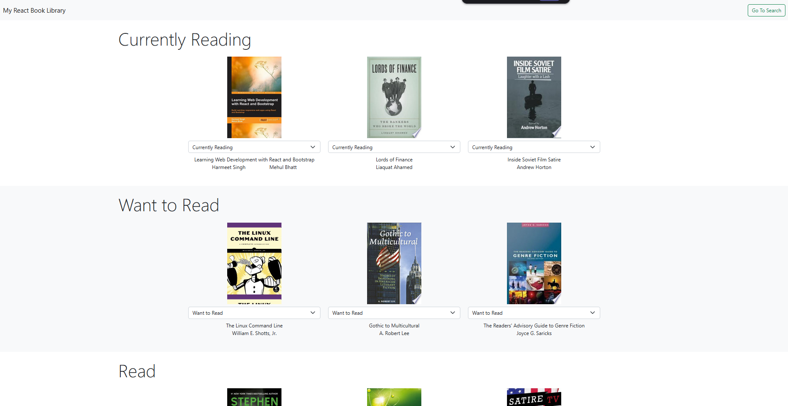

# MyReads - Book Tracking App

A **React.js** application for organizing and tracking your reading journey.  
Built as part of the **EGFWD React Fundamentals Nanodegree**, this app allows users to categorize books into shelves, search for new titles, and manage their reading list seamlessly using the **Udacity Books API**.

---

## 🌐 Live Demo
[View Live on GitHub Pages](https://ibrahim-rezq.github.io/egfwd-my-reads/)

---

## 🖼️ Preview


---

## 🎯 Purpose
This project was created to practice **React fundamentals** and **state management** within a real-world application scenario.  
The app focuses on:
- Managing book collections across multiple shelves
- Real-time search integration with external API
- Implementing React Router for seamless navigation
- Handling dynamic state updates and component communication

---

## 💡 Learning Takeaways
Working on this project helped me:
- Master **controlled components** and React state management
- Implement **debounce techniques** to optimize API calls during search
- Understand **component composition** and props flow
- Work with **React Router** for client-side routing
- Handle asynchronous operations and API integration
- Structure a React application with clean, maintainable code

---

## 🧩 Technologies Used
- **React.js**
- **React Router**
- **JavaScript (ES6+)**
- **HTML5 & CSS3**
- **Udacity Books API**

---

## ✨ Features

| Feature | Description |
|---------|-------------|
| **Shelf Management** | Organize books into three categories: Currently Reading, Want to Read, and Read |
| **Book Search** | Search and discover new books using the Udacity Books API |
| **Dynamic Updates** | Move books between shelves without page reload |
| **Persistent State** | Book shelf assignments are maintained across sessions |
| **Responsive Design** | Clean, user-friendly interface that works on all devices |

---

## 🚀 Getting Started

### 1. Clone the repository
```bash
git clone https://github.com/Ibrahim-Rezq/egfwd-my-reads.git
cd egfwd-my-reads
```

### 2. Install dependencies
```bash
npm install
```

### 3. Start the development server
```bash
npm start
```

The app runs on [http://localhost:3000](http://localhost:3000)

### 4. Build for production
```bash
npm run build
```

---

## 📂 Project Structure

```
egfwd-my-reads/
│
├── public/
│   ├── index.html
│   └── favicon.ico
│
├── src/
│   ├── components/
│   │   ├── Book.js              # Individual book component
│   │   ├── BookList.js          # Shelf display component
│   │   └── SearchBooks.js       # Search page component
│   ├── App.js                   # Main application component
│   ├── App.css                  # Application styles
│   ├── BooksAPI.js              # API utility functions
│   └── index.js                 # Application entry point
│
├── package.json
└── README.md
```

---

## 🧰 Scripts

| Script | Description |
|--------|-------------|
| `npm start` | Start the development server |
| `npm run build` | Create production build |
| `npm test` | Run test suite |
| `npm run eject` | Eject from Create React App (one-way operation) |

---

## 📚 API Usage

The app uses the **Udacity Books API** with the following methods:

| Method | Description |
|--------|-------------|
| `getAll()` | Retrieve all books currently on your shelves |
| `update(book, shelf)` | Move a book to a different shelf |
| `search(query)` | Search for books by title or author |

---

## 🎨 Application Flow

1. **Main Page** (`/`) - Displays all books organized by shelf
   - Currently Reading
   - Want to Read
   - Read

2. **Search Page** (`/search`) - Search for new books to add
   - Real-time search with debouncing
   - Add books directly to shelves
   - Visual feedback for books already on shelves

---
<!-- 
## 🗺️ Roadmap / To-Do

* [ ] Add user authentication for personalized libraries
* [ ] Implement book ratings and reviews
* [ ] Add sorting and filtering options for each shelf
* [ ] Include book details page with more information
* [ ] Add ability to create custom shelves
* [ ] Implement dark mode toggle
* [ ] Add loading states and better error handling

--- -->

## 🧠 Key Learnings

### Component Architecture
Learned to break down the UI into reusable components and manage data flow effectively through props and state.

### State Management
Understood how to lift state up and pass callbacks down to child components for synchronized updates.

### API Integration
Gained experience working with external APIs, handling async operations, and managing loading/error states.

### Performance Optimization
Implemented debouncing for search to reduce unnecessary API calls and improve user experience.

---

## 👨‍💻 Author

Created by [**Ibrahim Rezq**](https://github.com/Ibrahim-Rezq) as part of the EGFWD React Fundamentals Nanodegree program.

---

## 🙏 Acknowledgments

* **Udacity** - For the project specifications and Books API
* **EGFWD (Egypt FWD)** - For the React Fundamentals Nanodegree program

---

## ⚖️ License

This project is part of the Udacity React Nanodegree program. Feel free to use it for learning purposes.

---

## 🔗 Links

* **GitHub Repository:** [egfwd-my-reads](https://github.com/Ibrahim-Rezq/egfwd-my-reads)
* **Live Demo:** [MyReads App](https://ibrahim-rezq.github.io/egfwd-my-reads/)
* **Portfolio:** [Ibrahim Rezq](https://github.com/Ibrahim-Rezq)
